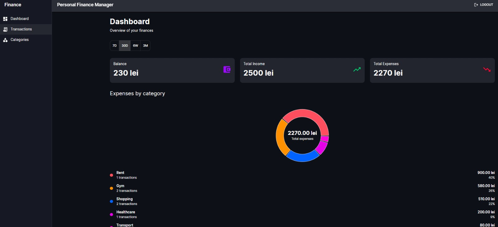
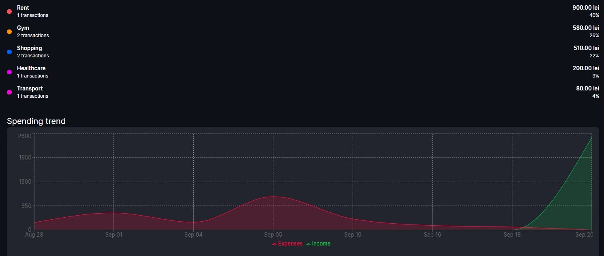
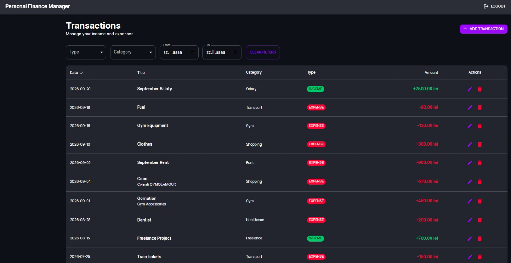
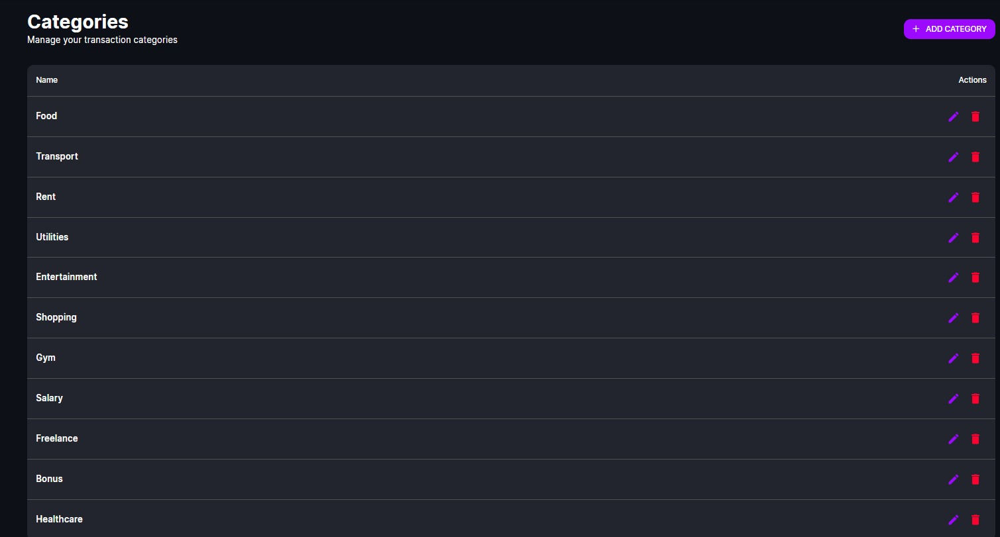

# Personal Finance Manager

A full-stack personal finance management application built with **Java, Spring Boot, PostgreSQL, React and TypeScript**.

The application allows users to securely manage their income and expenses, organize transactions into categories, filter financial data and analyze spending through an interactive dashboard.

The project was developed as a production-style portfolio application, with focus on **backend architecture, authentication, authorization, REST API design, testing, database modeling and frontend integration**.

---

## Screenshots

### Financial Dashboard

Interactive financial overview with dynamic period filtering, expense breakdown by category and financial summary metrics.



### Spending Trend

Income and expenses are dynamically aggregated by day, week or month depending on the selected period.



### Transaction Management

Transactions support filtering, sorting, pagination, categories and full CRUD operations.



### Category Management

Each authenticated user can create, edit and delete their own transaction categories.



---

## Key Features

### Authentication & Security

- User registration and login
- JWT access token authentication
- Refresh token support
- Refresh token rotation
- Automatic token refresh on the frontend
- Password hashing with Spring Security
- Protected REST endpoints
- User-specific data isolation
- Transaction ownership validation
- Category ownership validation

Each authenticated user can access and modify only their own financial data.

---

## Transaction Management

Users can:

- Create transactions
- Update transactions
- Delete transactions
- View transactions
- Filter transactions
- Sort transactions
- Paginate results

Transactions can be filtered by:

- transaction type
- category
- start date
- end date

Supported transaction types:

```text
INCOME
EXPENSE
```

---

## Category Management

Each user has their own categories.

Supported operations:

- Create category
- View categories
- Update category
- Delete category

The backend also validates category ownership.

A user cannot manually send another user's `categoryId` when creating or updating a transaction.

---

## Financial Dashboard

The dashboard provides an interactive overview of the user's finances.

### Summary Metrics

The dashboard displays:

- Balance
- Total income
- Total expenses
- Transaction count
- Latest transactions

---

### Dynamic Period Filtering

Users can analyze their finances using multiple time periods:

```text
7D  -> Last 7 days
30D -> Last 30 days
6W  -> Last 6 weeks
3M  -> Last 3 months
```

When the selected period changes, React recalculates the requested date range and fetches updated analytics from the backend.

---

## Expenses by Category

Expense transactions are grouped by category.

For every category the backend provides:

- category name
- total amount spent
- number of transactions

The frontend calculates the percentage of total spending and visualizes the data using an interactive donut chart.

Example:

```text
Rent         900.00 lei    40%
Gym          580.00 lei    26%
Shopping     510.00 lei    22%
Healthcare   200.00 lei     9%
Transport     80.00 lei     4%
```

---

## Income & Expense Trend

The dashboard also contains a time-based financial chart.

The aggregation strategy changes depending on the selected period:

```text
7D   -> DAY
30D  -> DAY
6W   -> WEEK
3M   -> MONTH
```

This makes the same analytics endpoint useful for different time ranges.

The frontend uses **Recharts** to visualize income and expenses over time.

---

## Tech Stack

### Backend

- Java
- Spring Boot
- Spring Web
- Spring Data JPA
- Hibernate
- Spring Security
- JWT
- PostgreSQL
- Maven
- Bean Validation
- Swagger / OpenAPI
- JUnit 5
- Mockito
- JaCoCo

### Frontend

- React
- TypeScript
- Vite
- Material UI
- Axios
- React Router
- React Hook Form
- Zod
- Recharts

### DevOps & Tooling

- Docker
- Docker Compose
- Git
- GitHub
- GitHub Actions
- Automated tests
- CI workflow
- Production frontend build

---

## Architecture

The backend follows a layered architecture:

```text
Controller
    |
    v
Service
    |
    v
Repository
    |
    v
PostgreSQL
```

Additional backend components include:

```text
DTOs
Mappers
Specifications
Security Filters
JWT Services
CurrentUserService
Exception Handling
```

The frontend communicates with the backend through REST APIs:

```text
React + TypeScript
        |
        | Axios
        v
Spring Boot REST API
        |
        v
Service Layer
        |
        v
Spring Data JPA
        |
        v
PostgreSQL
```

---

## Dashboard Data Flow

When the user selects another dashboard period:

```text
User selects period
        |
        v
React state changes
        |
        v
useEffect executes
        |
        v
Date range is calculated
        |
        v
Grouping strategy is selected
        |
        +------ DAY
        |
        +------ WEEK
        |
        +------ MONTH
        |
        v
API requests execute in parallel
        |
        +--> Dashboard summary
        |
        +--> Category summary
        |
        +--> Period summary
        |
        v
React state updates
        |
        v
Charts and cards re-render
```

The frontend uses:

```typescript
Promise.all(...)
```

to load dashboard analytics in parallel instead of waiting for each request sequentially.

---

## REST API

### Authentication

```http
POST /api/auth/register
POST /api/auth/login
POST /api/auth/refresh
```

---

### Transactions

```http
GET    /api/transactions
POST   /api/transactions
PUT    /api/transactions/{id}
DELETE /api/transactions/{id}
```

Transactions support pagination, sorting and filtering.

Example:

```http
GET /api/transactions?page=0&size=10&sortBy=date&sortDir=desc
```

Example with filters:

```http
GET /api/transactions?type=EXPENSE&categoryId=2&startDate=2026-09-01&endDate=2026-09-30
```

---

### Categories

```http
GET    /api/categories
POST   /api/categories
PUT    /api/categories/{id}
DELETE /api/categories/{id}
```

---

### Dashboard

```http
GET /api/dashboard
GET /api/dashboard/category-summary
GET /api/dashboard/period-summary
GET /api/dashboard/monthly-summary
```

Example category analytics request:

```http
GET /api/dashboard/category-summary?startDate=2026-09-01&endDate=2026-09-30
```

Example weekly analytics request:

```http
GET /api/dashboard/period-summary?startDate=2026-08-01&endDate=2026-09-30&groupBy=WEEK
```

The dashboard can also filter by category:

```http
GET /api/dashboard/period-summary?startDate=2026-08-01&endDate=2026-09-30&categoryId=9&groupBy=WEEK
```

---

## Security Design

The application does not trust resource IDs received from the client.

For example, when creating or updating a transaction, the backend checks that the selected category belongs to the currently authenticated user.

Conceptually:

```text
categoryId
    |
    v
Find category using:
categoryId + currentUser
    |
    +--> Category exists and belongs to user
    |        |
    |        v
    |     Continue
    |
    +--> Category does not belong to user
             |
             v
        Reject request
```

Transaction ownership is also checked before update and delete operations.

This prevents one authenticated user from modifying another user's financial data.

---

## Database Relationships

The main domain model contains:

```text
User
 |
 | 1
 |
 +------< Category


User
 |
 | 1
 |
 +------< Transaction


Category
 |
 | 1
 |
 +------< Transaction
```

Each category belongs to a user.

Each transaction belongs to a user and can reference one category.

---

## Dynamic Transaction Filtering

Transaction filtering is implemented using Spring Data JPA Specifications.

The backend dynamically builds query conditions depending on the provided filters.

Conceptually:

```text
Current User
    +
Transaction Type
    +
Category
    +
Start Date
    +
End Date
```

Only filters provided by the client are included in the query.

This avoids creating separate repository methods for every possible filter combination.

---

## Testing

The backend currently contains **56 automated tests**.

Latest test result:

```text
Tests run: 56
Failures: 0
Errors: 0
Skipped: 0

BUILD SUCCESS
```

Testing technologies:

- JUnit 5
- Mockito
- Spring testing utilities
- JaCoCo

Tests cover important service and controller behavior, including ownership and error scenarios.

Run backend tests with:

### Windows

```powershell
.\mvnw test
```

### Linux / macOS

```bash
./mvnw test
```

---

## Frontend Production Build

The frontend is validated using TypeScript before Vite creates the production bundle.

Run:

```bash
npm run build
```

Build pipeline:

```text
TypeScript compilation
        |
        v
Vite production build
        |
        v
Production assets
```

Current production build completes successfully.

---

## Docker

The project includes:

```text
Dockerfile
docker-compose.yml
.dockerignore
```

Docker Compose can be used to run the required infrastructure, including PostgreSQL.

```bash
docker compose up -d
```

---

## Running the Project Locally

### 1. Clone the repository

```bash
git clone https://github.com/Kutaba-Victor-30127/personal-finance-manager.git
```

Enter the project:

```bash
cd personal-finance-manager
```

---

### 2. Start PostgreSQL

Using Docker:

```bash
docker compose up -d
```

---

### 3. Start the Spring Boot Backend

Windows:

```powershell
.\mvnw spring-boot:run
```

Linux / macOS:

```bash
./mvnw spring-boot:run
```

Backend:

```text
http://localhost:8080
```

---

### 4. Start the React Frontend

```bash
cd frontend
npm install
npm run dev
```

Vite will display the local frontend URL in the terminal.

---

## API Documentation

The project includes Swagger / OpenAPI documentation.

After starting the backend, the REST API can be explored and tested through Swagger UI.

Authentication-protected endpoints require a valid JWT access token.

---

## Error Handling

The backend includes centralized exception handling for API errors.

Examples include:

- Transaction not found
- Category not found
- Unauthorized resource access
- Authentication errors
- Validation errors

This keeps error responses consistent across the application.

---

## Engineering Highlights

This project demonstrates practical experience with:

- Java
- Spring Boot
- REST API design
- Layered backend architecture
- Spring Security
- JWT authentication
- Refresh tokens
- Authorization
- Ownership validation
- PostgreSQL
- Relational database modeling
- Spring Data JPA
- Hibernate
- Dynamic filtering
- Specifications
- Pagination
- Sorting
- Transactional service methods
- DTOs and mapping
- Exception handling
- React
- TypeScript
- Material UI
- Axios
- React state management
- React hooks
- Parallel API requests
- Data aggregation
- Financial analytics
- Data visualization
- Docker
- Automated testing
- CI workflows

---

## Project Structure

```text
personal-finance-manager/
│
├── .github/
│   └── workflows/
│
├── docs/
│   └── screenshots/
│       ├── dashboard.jpeg
│       ├── spending-trend.jpeg
│       ├── transactions.jpeg
│       └── categories.jpeg
│
├── frontend/
│   ├── src/
│   ├── package.json
│   └── vite.config.ts
│
├── src/
│   ├── main/
│   │   └── java/
│   └── test/
│       └── java/
│
├── Dockerfile
├── docker-compose.yml
├── pom.xml
├── mvnw
├── mvnw.cmd
└── README.md
```

---

## Future Improvements

Possible future improvements include:

- Budgets and spending limits
- Recurring transactions
- CSV import/export
- Merchant information
- More advanced financial analytics
- Frontend automated tests
- Improved frontend code splitting
- Cloud deployment
- Notifications
- Additional dashboard insights

---

## Project Status

The main application workflow is complete and functional:

```text
Authentication
      |
      v
Category Management
      |
      v
Transaction Management
      |
      v
Filtering / Sorting / Pagination
      |
      v
Financial Analytics
      |
      v
Interactive Dashboard
```

The application currently has a passing backend test suite and a successful frontend production build.

---

## Author

**Victor Kutaba**

Software developer focused on **Java, Spring Boot, backend development and full-stack web applications**.

GitHub: [Kutaba-Victor-30127](https://github.com/Kutaba-Victor-30127)